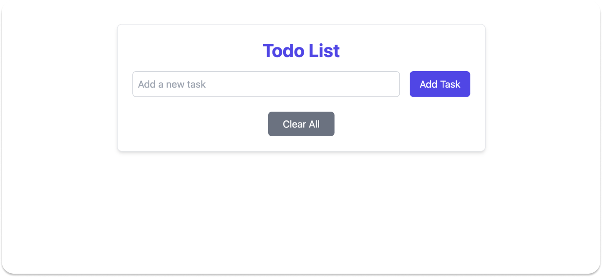

# Todo List Application

A simple, interactive, and responsive Todo List application built with React and Tailwind CSS. You can add, delete, and mark tasks as completed. The tasks are dynamically rendered with options to manage your daily activities efficiently.

## Features

- Add new tasks
- Mark tasks as completed
- Delete tasks
- Clear all tasks
- Responsive and accessible design

## Live Demo

You can view the live version of the application here: [Todo List Live](https://todork.netlify.app)

## Tech Stack

- **Frontend**: React
- **Styling**: Tailwind CSS
- **Icons**: React Icons (MdCheck, MdDeleteForever)
